# Tutorial: Create a simple service and communicate with MSB

## Goals of this tutorial

This tutorial will cover:
- introduction to VFK MSB (Manufacturing Service Bus) concept
- Connect one Application to the msb
- Send data to the MSB and receive it again


## How does the MSB work?

The MSB enables your service (app, hardware, ...) to communicate with other services even if their data formats are different.

The MSB client libraries help you to specify a self-description and connect and register you service with the MSB.

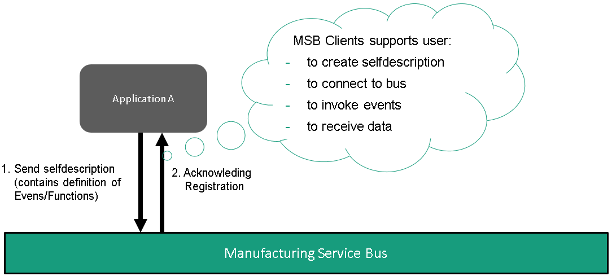

The communication managed by the MSB is based on events and functions of each service.

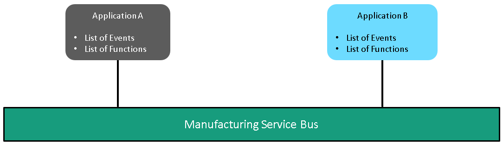

The MSB maps events to functions by mapping their data formats.

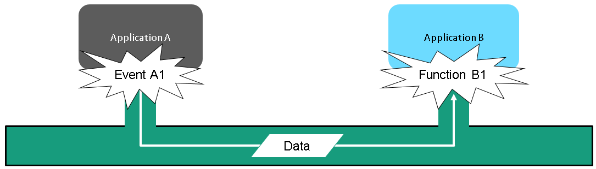

## Prerequisites

* Setup [Python](https://www.python.org/downloads/) **version 3.6.x**
* Create a new empty project folder
* Copy the content of the [Project Template](./project_template) into your new project folder: 
* Install MSB client from ```PyPi```
```sh
pip install msb-client-websocket-python
```
* Optional: Use ```pipenv``` to run your python app in a virtual environment to avoid dependency isssues with other apps
```sh
python -m pipenv install
```
```sh
python -m pipenv shell
```
When using ```pipenv``` make sure to start the ```pipenv shell``` an execute the python commands for the project here.

## Adapt application.properties

To set your service identification adapt the application.proerties file:
- Note: You can either set type to ```Application``` or ```SmartObject``` (for tutorial set type to ```Application```)

```python
msb.uuid=<insert-random-UUID>
msb.name=<insert-desired-name-of-your-application>
msb.description=<insert-desired-description-of-your-application>
msb.token=<insert-random-token>
msb.type=Application
msb.url=<url-of-running-msb-websocket-interface> e.g. ws://ws.msb.<host>.de or ws://localhost:8085
```

## Initial run of main.py

Now you are ready to connect and register your application with the MSB.

Your main.py looks like this:
```python
import datetime
import threading
import uuid
import time

from msb_client.ComplexDataFormat import ComplexDataFormat
from msb_client.DataType import DataType
from msb_client.Event import Event
from msb_client.Function import Function
from msb_client.MsbClient import MsbClient

if __name__ == "__main__":

    myMsbClient = MsbClient()

    myMsbClient.enableDebug(True)
    myMsbClient.disableHostnameVerification(True)
    myMsbClient.disableEventCache(False)

    print(myMsbClient.objectToJson(myMsbClient.getSelfDescription()))
    
    myMsbClient.connect()

    myMsbClient.register()
```

Start your application with:
```sh
python main.py
```

If successfully connected to MSB, an ```IO_CONNECTED``` and ```IO_REGISTERED``` message is logged. 
```sh
INFO:root:Connecting to MSB @ ws://localhost:8085
{
    "@class": "Application",
    "configuration": {
        "parameters": {}
    },
    "description": "Showing MSB Stuff",
    "events": [],
    "functions": [],
    "name": "Python_Tutorial",
    "token": "0993e25bae3b",
    "uuid": "f3d880ce-fb3f-44a4-b407-0993e25bae3b"
}
DEBUG:root:Socket open
INFO:root:IO_CONNECTED
INFO:root:IO_REGISTERED
DEBUG:root:♥
```

## Confirm rgistration in MSB GUI

Login to MSB GUI:
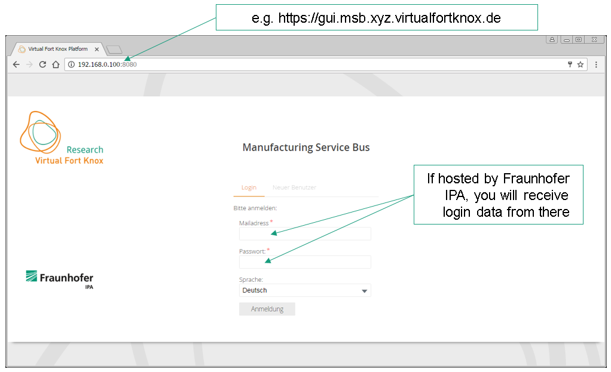

Open list of applications:
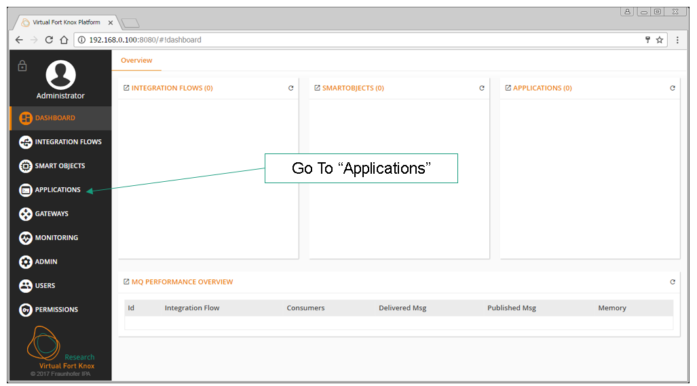

Verify your application with your token:
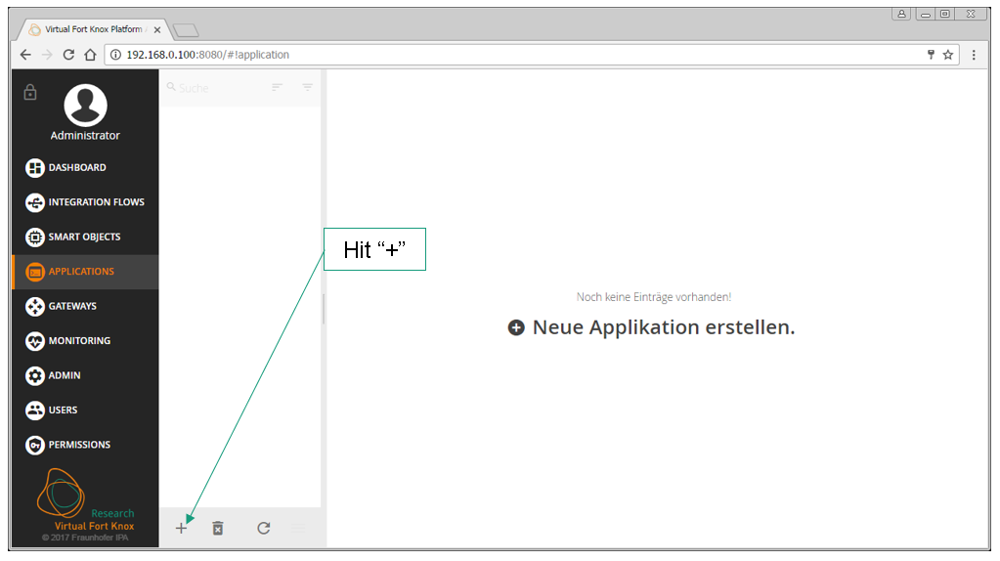
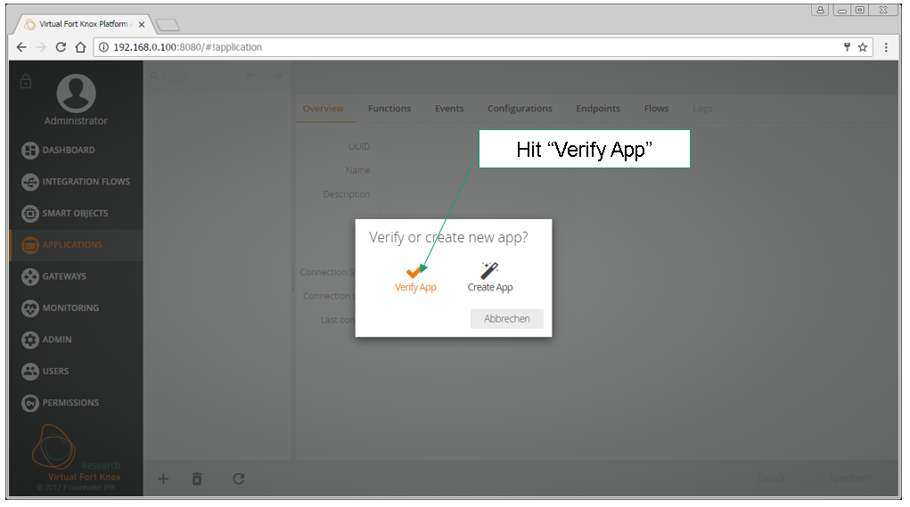
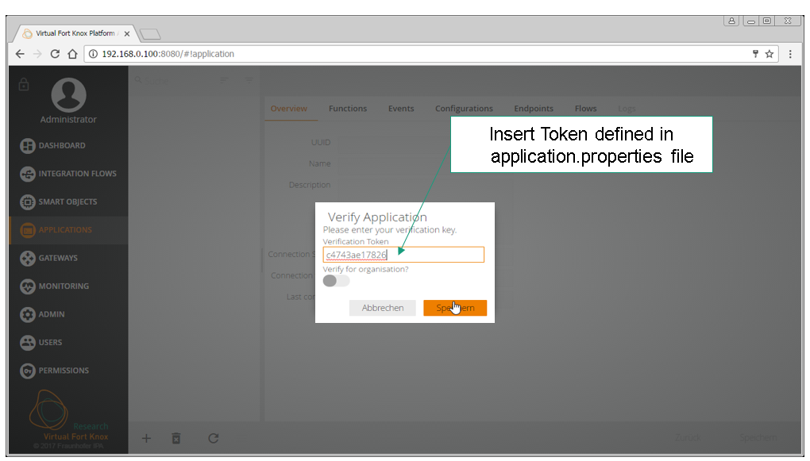
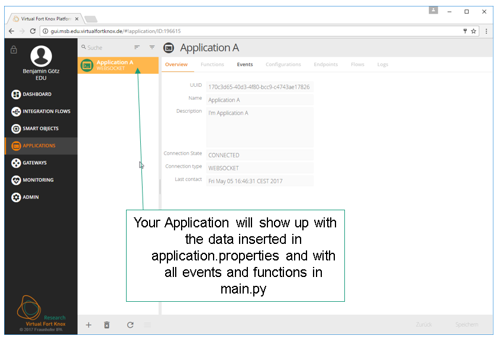

## Add your first event

```python
...
if __name__ == "__main__":

    myMsbClient = MsbClient()

    myMsbClient.enableDebug(True)
    myMsbClient.disableHostnameVerification(True)
    myMsbClient.disableEventCache(False)

    # add your first event here
    myMsbClient.addEvent(
        event="event1", # event id
        event_name="Event Name",
        event_description="Event Description",
        event_dataformat=DataType.STRING,
    )

    print(myMsbClient.objectToJson(myMsbClient.getSelfDescription()))
    
    myMsbClient.connect()

    myMsbClient.register()
```

Restart your application:
```sh
python main.py
```

See the extended self-description in the log including the new event:
```sh
INFO:root:Connecting to MSB @ ws://localhost:8085
{
    "@class": "Application",
    "configuration": {
        "parameters": {}
    },
    "description": "Showing MSB Stuff",
    "events": [
        {
            "@id": 1,
            "dataFormat": {
                "dataObject": {
                    "type": "string"
                }
            },
            "description": "Event Description",
            "eventId": "event1",
            "name": "Event Name"
        }
    ],
    "functions": [],
    "name": "Python_Tutorial",
    "token": "0993e25bae3b",
    "uuid": "f3d880ce-fb3f-44a4-b407-0993e25bae3b"
}
DEBUG:root:Socket open
INFO:root:IO_CONNECTED
INFO:root:IO_REGISTERED
DEBUG:root:♥
```

Notice that also the application in GUI is updated with the new event:
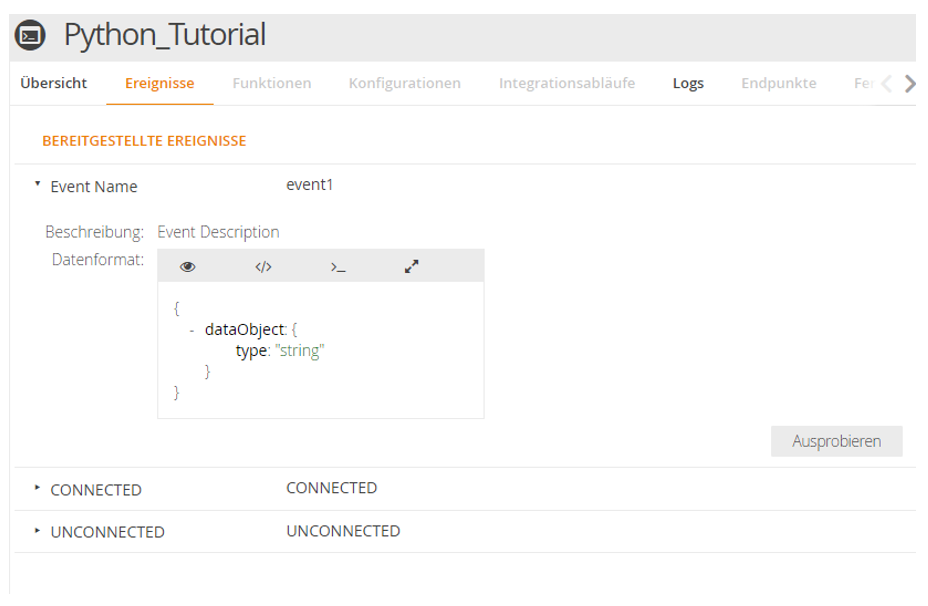

## Add your first function

```python
...

# add your function implementation here
def printMsg(msg):
    print(str(msg["dataObject"]))

if __name__ == "__main__":

    myMsbClient = MsbClient()

    myMsbClient.enableDebug(True)
    myMsbClient.disableHostnameVerification(True)
    myMsbClient.disableEventCache(False)

    myMsbClient.addEvent(
        event="event1", # event id
        event_name="Event Name",
        event_description="Event Description",
        event_dataformat=DataType.STRING,
    )

    # add your function here
    myMsbClient.addFunction(
        function="function1", # function id
        function_name="Function Name",
        function_description="Function Description",
        function_dataformat=DataType.STRING,
        fnpointer=printMsg,
        isArray=False,
        responseEvents=None,
    )

    print(myMsbClient.objectToJson(myMsbClient.getSelfDescription()))
    
    myMsbClient.connect()

    myMsbClient.register()
```

Restart your application:
```sh
python main.py
```

See the extended self-description in the log including the new function:
```sh
INFO:root:Connecting to MSB @ ws://localhost:8085
{
    "@class": "Application",
    "configuration": {
        "parameters": {}
    },
    "description": "Showing MSB Stuff",
    "events": [
        {
            "@id": 1,
            "dataFormat": {
                "dataObject": {
                    "type": "string"
                }
            },
            "description": "Event Description",
            "eventId": "event1",
            "name": "Event Name"
        }
    ],
    "functions": [
        {
            "dataFormat": {
                "dataObject": {
                    "type": "string"
                }
            },
            "description": "Function Description",
            "functionId": "function1",
            "name": "Function Name"
        }
    ],
    "name": "Python_Tutorial",
    "token": "0993e25bae3b",
    "uuid": "f3d880ce-fb3f-44a4-b407-0993e25bae3b"
}
DEBUG:root:Socket open
INFO:root:IO_CONNECTED
INFO:root:IO_REGISTERED
DEBUG:root:♥
```

Notice that also the application in GUI is updated with the new function:
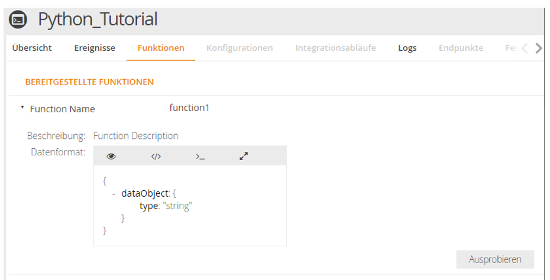

## Connect the event and the function in MSB GUI 

The integration flow designe is used to link events with functions and map their data formats.

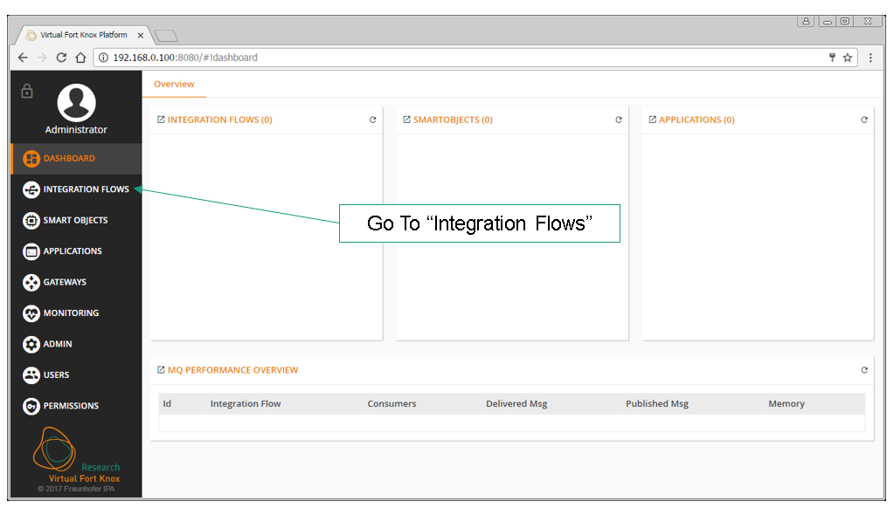
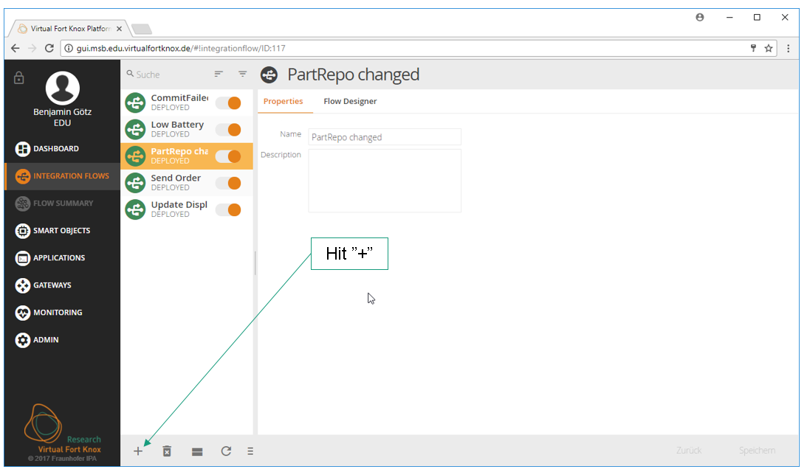
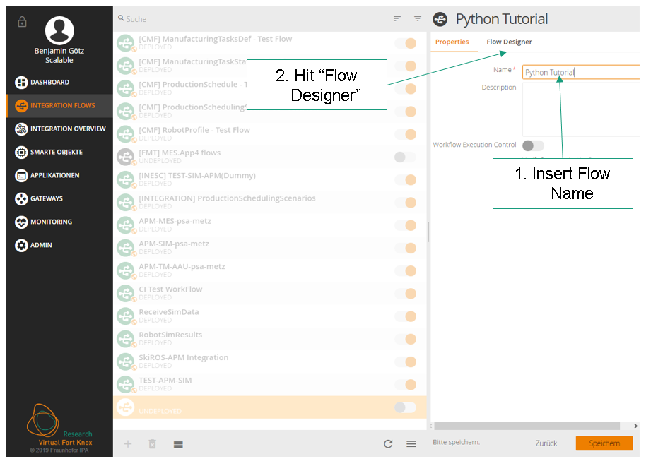
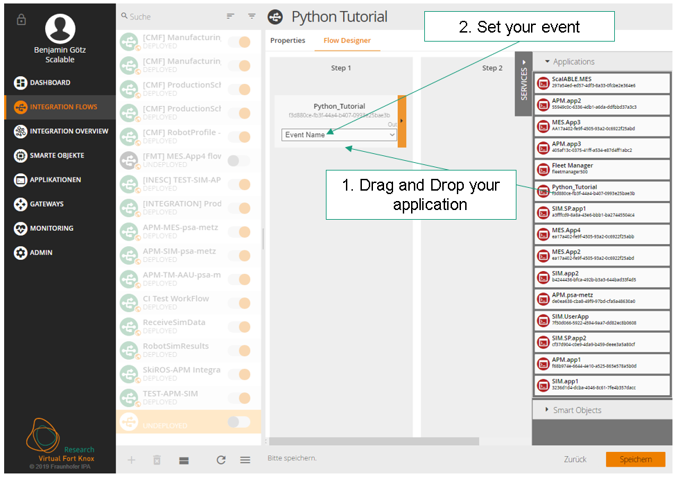
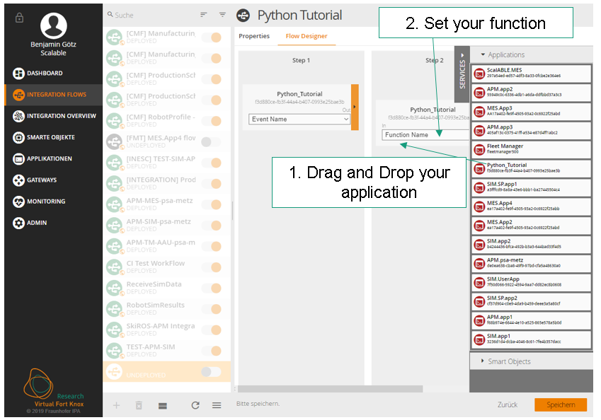
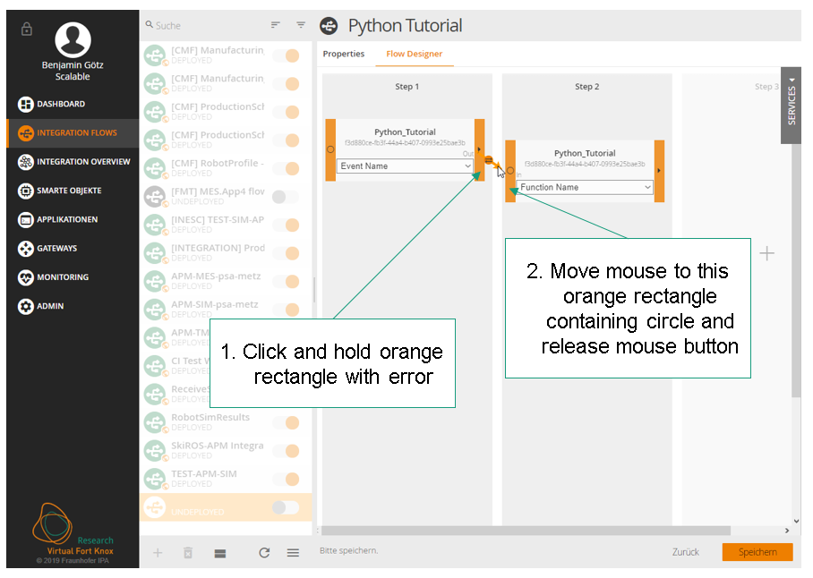
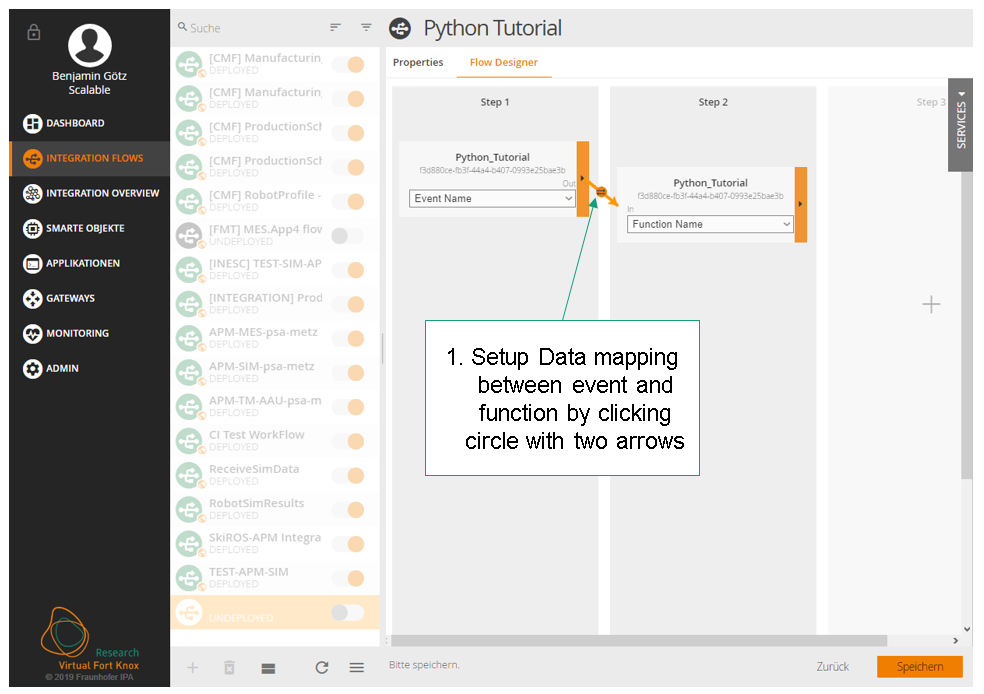
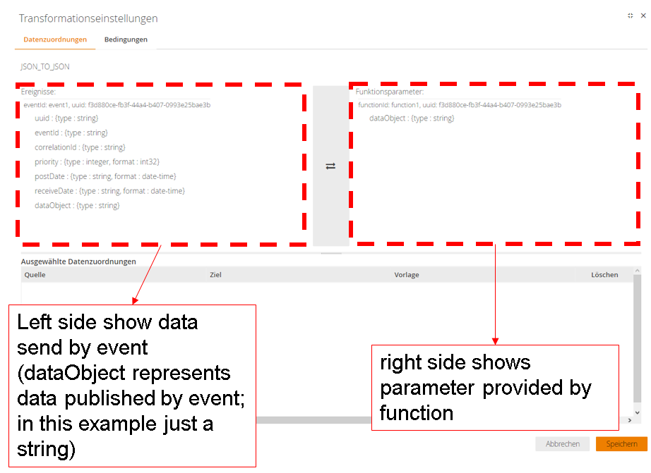
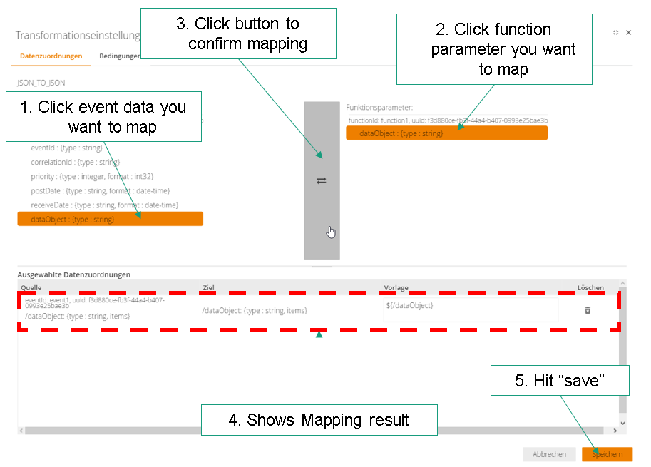
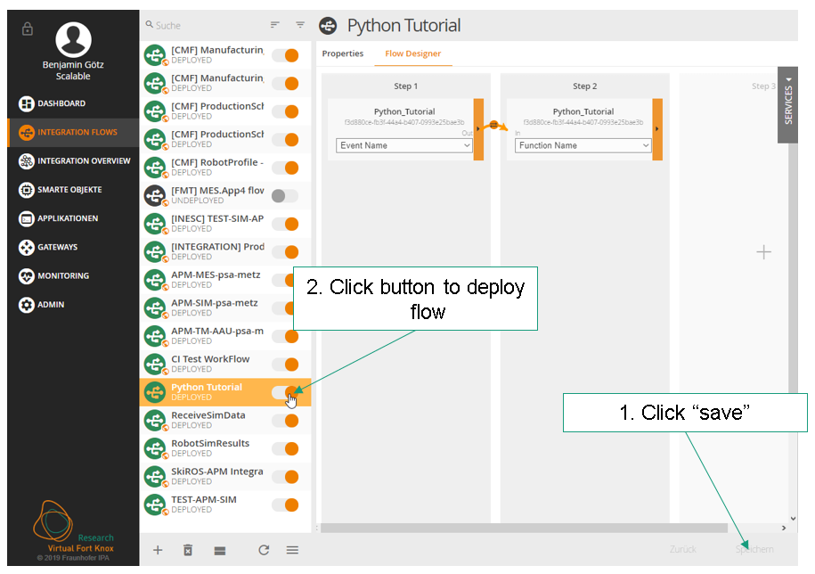

## Publish your first event and test integration flow


```python
...

def printMsg(msg):
    print(str(msg["dataObject"]))

if __name__ == "__main__":

    myMsbClient = MsbClient()

    myMsbClient.enableDebug(True)
    myMsbClient.disableHostnameVerification(True)
    myMsbClient.disableEventCache(False)

    myMsbClient.addEvent(
        event="event1", # event id
        event_name="Event Name",
        event_description="Event Description",
        event_dataformat=DataType.STRING,
    )

    myMsbClient.addFunction(
        function="function1", # function id
        function_name="Function Name",
        function_description="Function Description",
        function_dataformat=DataType.STRING,
        fnpointer=printMsg,
        isArray=False,
        responseEvents=None,
    )

    print(myMsbClient.objectToJson(myMsbClient.getSelfDescription()))
    
    myMsbClient.connect()

    myMsbClient.register()

    # add code to publish event here
    myMsbClient.publish(
        eventId="event1",
        dataObject="Hello World",
        priority=0,
        cached=True,
        postDate=None,
        correlationId=None,
    )
```
Restart your application:
```sh
python main.py
```

See the ```IO_PUBLISHED``` in the log and the received message "Hello World":
```sh
INFO:root:Connecting to MSB @ ws://localhost:8085
{
    "@class": "Application",
    "configuration": {
        "parameters": {}
    },
    "description": "Showing MSB Stuff",
    "events": [
        {
            "@id": 1,
            "dataFormat": {
                "dataObject": {
                    "type": "string"
                }
            },
            "description": "Event Description",
            "eventId": "event1",
            "name": "Event Name"
        }
    ],
    "functions": [
        {
            "dataFormat": {
                "dataObject": {
                    "type": "string"
                }
            },
            "description": "Function Description",
            "functionId": "function1",
            "name": "Function Name"
        }
    ],
    "name": "Python_Tutorial",
    "token": "0993e25bae3b",
    "uuid": "f3d880ce-fb3f-44a4-b407-0993e25bae3b"
}
DEBUG:root:Socket open
INFO:root:IO_CONNECTED
INFO:root:IO_REGISTERED
DEBUG:root:♥
DEBUG:root:SENDING (BUF): {
    "dataObject": "Hello World",
    "eventId": "event1",
    "postDate": "2019-07-25T14:55:40.794815",
    "priority": 0,
    "uuid": "f3d880ce-fb3f-44a4-b407-0993e25bae3b"
}
INFO:root:IO_PUBLISHED
INFO:root:{'uuid': 'f3d880ce-fb3f-44a4-b407-0993e25bae3b', 'correlationId': '77b1a32b-1597-4470-9cf5-25a42fa26ada', 'functionId': 'function1', 'functionParameters': {'dataObject': 'Hello World'}}
Hello World
DEBUG:root:♥
```

You are now ready to extend your aplication by adding more events and functions and using them in integrations flows.